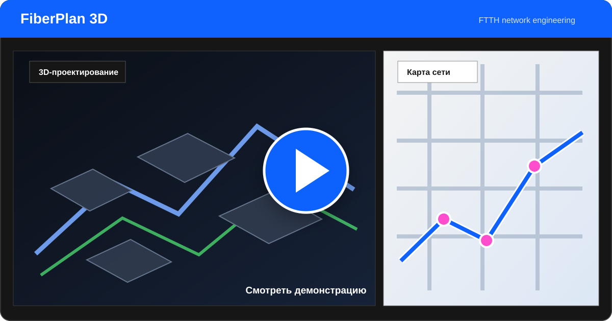

# FiberPlan 3D

<p align="center">
  <strong>Браузерный редактор оптоволоконной сети поверх реальной 3D-модели территории</strong>
</p>

<p align="center">
  
  
  
  
  
</p>

FiberPlan 3D помогает проектировать подключение сёл и других территорий к
оптоволоконной сети. В одном интерфейсе можно загрузить фотограмметрическую
3D-модель, разместить муфты, опоры, абонентов и узлы связи, проложить кабели и
увидеть рассчитанную длину трасс.

## Демо

<p align="center">
  <a href="./assets/demo.mp4">
    
  </a>
</p>

<p align="center">
  <a href="./assets/demo.mp4"><strong>▶ Смотреть demo.mp4</strong></a>
  · 29 МБ
</p>

Проект работает полностью на стороне браузера: backend и предварительная
распаковка модели не требуются, а выбранные файлы не отправляются на сервер.

## Основные возможности

| Область | Возможности |
| --- | --- |
| **3D-модель** | GLB и ZIP с `tileset.json`, B3DM/GLB-тайлы, Draco, автоматический выбор LOD |
| **Карта** | OpenStreetMap и спутник Esri, граница модели, геопривязка и ручная калибровка |
| **Проектирование** | Муфты, опоры, здания/абоненты, узлы связи, воздушные и подземные линии |
| **Расчёты** | Длина кабеля, технологический запас, исключение выбранной линии из плана |
| **Состояния** | План, активная линия, обслуживание и фильтрация сети по типам |
| **Синхронизация** | Перемещение и масштаб карты следуют за 3D; карта также управляет 3D-камерой |
| **Хранение** | Автосохранение в `localStorage` и экспорт схемы в JSON |

## Быстрый запуск в WSL

Требуются Node.js 24 и npm. Рекомендуется запускать проект из файловой системы
Linux, а не из `/mnt/c`, особенно при работе с большими ZIP-моделями.

```bash
cd ~/projects/fiber-village-3d

nvm install
nvm use
npm install
npm run dev -- --host 0.0.0.0
```

Откройте адрес из терминала Vite — обычно
[http://localhost:5173](http://localhost:5173) или
[http://localhost:5174](http://localhost:5174).

## Как спроектировать сеть

1. Нажмите **Открыть ZIP / GLB** и выберите модель территории.
2. Проверьте границу модели и её направление на карте.
3. Выберите **Новый узел**, тип объекта и режим высоты:
   - поверхность здания;
   - уровень земли рядом со зданием.
4. Разместите муфты, опоры, абонентов и узлы связи в 3D или на карте.
5. Выберите тип кабеля и нажмите **Проложить кабель**.
6. Соедините два узла либо начните ответвление с любой точки существующей линии.
7. Переведите линии из плана в активные, настройте фильтры и экспортируйте JSON.

После добавления узла редактор остаётся в режиме размещения точек и не
переключается на кабель автоматически.

## Управление

### 3D-сцена

| Действие | Управление |
| --- | --- |
| Вращение мышью | левая кнопка мыши |
| Перемещение | `W A S D` или стрелки |
| Поворот камеры | `Q` / `E` |
| Наклон камеры | `I` / `K` |
| Подъём и спуск | `R` / `F` |
| Масштаб | колесо мыши или `+` / `−` |
| Ускорение | удерживать `Shift` |
| Отмена текущего действия | `Esc` |

### Карта и 3D

Карта и 3D-сцена используют общий центр просмотра:

- движение или масштабирование в 3D перемещает карту;
- перетаскивание или масштабирование карты перемещает 3D-камеру;
- карта остаётся ориентированной на географический север.

## Поддерживаемые модели

### GLB

Обычный бинарный glTF-файл можно открыть напрямую. Модель автоматически
центрируется и масштабируется для удобного просмотра.

### ZIP с 3D Tiles

Архив может содержать вложенные каталоги. Приложение самостоятельно находит
верхний `tileset.json`, связанные JSON и содержимое `.b3dm`/`.glb`.

Чтобы снизить расход памяти:

- ZIP читается по отдельным записям без полной распаковки;
- выбирается подходящий уровень детализации;
- бюджет выбранного LOD по умолчанию ограничен примерно 24 МБ;
- Draco-декодирование выполняется с ограниченным числом работников.

Проверить архив без запуска интерфейса:

```bash
npm run check:zip -- /path/to/model.zip
```

## Геопривязка

Для геопривязанных 3D Tiles приложение извлекает начало локальной системы
координат, преобразует ECEF в WGS84 и определяет название территории через
OpenStreetMap. При необходимости положение можно вручную сдвинуть по сторонам
света и повернуть с шагом `0,1°`.

## Команды проекта

```bash
# Разработка
npm run dev

# TypeScript-проверка и production-сборка
npm run build

# Локальный просмотр production-сборки
npm run preview

# Проверка расчётов сети и ответвлений
npm run check:network

# Проверка преобразований координат
npm run check:geodesy

# Проверка конкретного ZIP
npm run check:zip -- /path/to/model.zip
```

## Технологии

- [TypeScript](https://www.typescriptlang.org/) — типизированная логика приложения;
- [Three.js](https://threejs.org/) — 3D-сцена, модель и интерактивная сеть;
- [Leaflet](https://leafletjs.com/) — географическая карта;
- [zip.js](https://gildas-lormeau.github.io/zip.js/) — потоковое чтение ZIP;
- [Vite](https://vite.dev/) — разработка и production-сборка;
- IBM Plex Sans и визуальные принципы инженерного интерфейса Carbon.

## Структура

```text
src/
├── main.ts          # интерфейс и координация режимов
├── scene.ts         # Three.js-сцена и управление камерой
├── map.ts           # Leaflet-карта и синхронизация с 3D
├── store.ts         # состояние сети и расчёты
├── geodesy.ts       # ECEF/WGS84 и локальные координаты
├── zip-tileset.ts   # чтение ZIP и выбор 3D Tiles
├── geocoding.ts     # определение названия территории
├── types.ts         # общие типы
└── style.css        # интерфейс FiberPlan 3D
```

Дизайн-контракт проекта описан в [DESIGN.md](./DESIGN.md).

## Лицензия

Проект распространяется по лицензии [MIT](./LICENSE).

Copyright © 2026 Baubek Serikbay.
